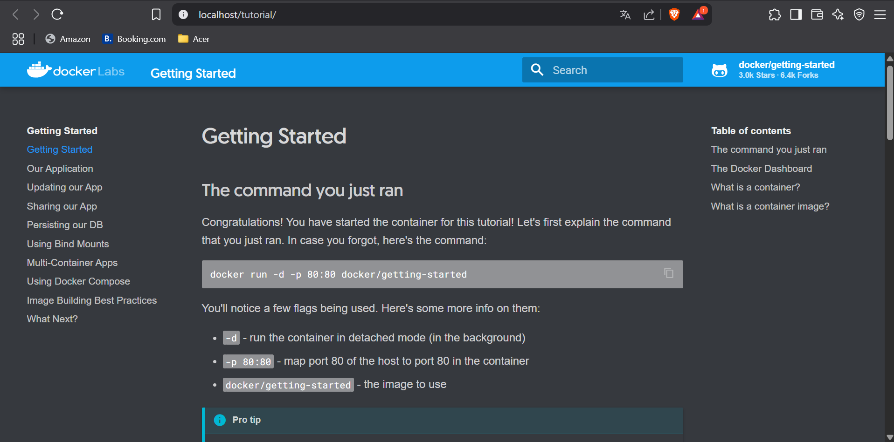

# Docker Grundlagen

## A




## B

### 1. Überprüfen der Docker-Version

```bash
docker --version
```

Dieser Befehl zeigt die aktuell installierte Version von Docker an.

### 2. Suchen nach offiziellen Images auf Docker Hub

```bash
docker search ubuntu
docker search nginx
```

Dies durchsucht Docker Hub nach Images mit dem Namen `ubuntu` oder `nginx`.

### 3. Erklärung des Befehls `docker run -d -p 80:80 docker/getting-started`

```bash
docker run -d -p 80:80 docker/getting-started
```

#### Erklärung der Parameter:

* `run`: Startet einen neuen Container.
* `d`: Detached Mode (Container läuft im Hintergrund).
* `-p 80:80`: Mappt Port 80 des Hosts auf Port 80 des Containers.
* `docker/getting-started`: Name des zu verwendenden Docker-Images.

### 4. Arbeiten mit dem `nginx` Image – Vergleich von `run` mit `pull`, `create`, `start`

#### 4.1 Image herunterladen

```bash
docker pull nginx
```

#### 4.2 Container erstellen mit Port-Mapping (8081:80)

```bash
docker create -p 8081:80 --name my-nginx nginx
```

#### 4.3 Container starten

```bash
docker start my-nginx
```

**Hinweis:** Falls Port 8081 bereits verwendet wird:

```bash
docker ps
docker stop <container-id>
```

#### 4.4 Screenshot der nginx Startseite

Rufe `http://localhost:8081` auf.


### 5. Arbeiten mit dem `ubuntu` Image – Unterschiede im Verhalten

#### 5.1 Versuch: Ubuntu im Hintergrund starten

```bash
docker run -d ubuntu
```

**Kommentar:**

* Das Image wird automatisch heruntergeladen, wenn es nicht lokal vorhanden ist.
* Der Container wird sofort beendet, da kein Prozess im Vordergrund aktiv bleibt.
* Der Container kann mit `docker ps -a`, aber nicht mit `docker ps` angezeigt werden.

#### 5.2 Ubuntu interaktiv starten

```bash
docker run -it ubuntu
```

**Kommentar:**

* Der Container startet mit einer interaktiven Shell.
* Befehle können direkt ausgeführt werden, z.B. `ls`, `apt update`, etc.
* Sobald `exit` eingegeben wird, wird der Container beendet.

### 6. Interaktive Shell auf laufenden `nginx` Container öffnen

#### 6.1 Shell starten

```bash
docker exec -it my-nginx /bin/bash
```

#### 6.2 Status von nginx anzeigen

```bash
service nginx status
```


#### 6.3 Shell verlassen

```bash
exit
```

### 7. Status aller Container überprüfen

```bash
docker ps -a
```


### 8. nginx Container stoppen

```bash
docker stop my-nginx
```

### 9. Alle Container entfernen

```bash
docker container prune -f
```

**Alternativ:**

```bash
docker rm $(docker ps -aq)
```

### 10. Entfernen der Images `nginx` und `ubuntu`

```bash
docker rmi nginx
docker rmi ubuntu
```

## C


## D

```bash
docker pull nginx
```

**Hinweis:**

* Das heruntergeladene Image erhält automatisch den Tag `latest`.
* Der Tag wird verwendet, um Versionen, Varianten eines Images zu unterscheiden

## 2. Image umbenennen mit `docker tag`

```bash
docker tag nginx:latest eduard1233/m347:nginx
```

### Erklärung:

* Der Befehl `docker tag` erzeugt einen **weiteren Verweis (Alias)** auf ein bestehendes Image.
* Es wird **kein neues Image erstellt**, sondern das bestehende Image erhält eine neue Adresse:

  * `nginx:latest` ➞ `eduard1233/m347:nginx`
* Der **Tag** `nginx` hilft, Versionen in deinem Repository zu unterscheiden.
* So kannst du mehrere Images in einem Repository mit unterschiedlichen Tags verwalten, z.B. `nginx`, `mariadb`.

## 3. Image in das eigene Repository hochladen mit `docker push`

```bash
docker push eduard1233/m347:nginx
```

### Erklärung:

* Mit `docker push` wird das getaggte Image in dein Repository hochgeladen.
* Voraussetzung: Du musst im Docker Hub eingeloggt sein.

## 4. Herunterladen von `mariadb` und Tagging

```bash
docker pull mariadb
docker tag mariadb:latest eduard1233/m347:mariadb
```

**Erklärung:**

* Das Image `mariadb:latest` wird vom Docker Hub geladen.
* Danach wird es auch im eigenen Repository und im Tag `mariadb` referenziert.

## 5. Push von `mariadb` in dein Repository

```bash
docker push eduard1233/m347:mariadb
```

### Erklärung:

* Auch hier wird das Image in das Repository hochgeladen.

