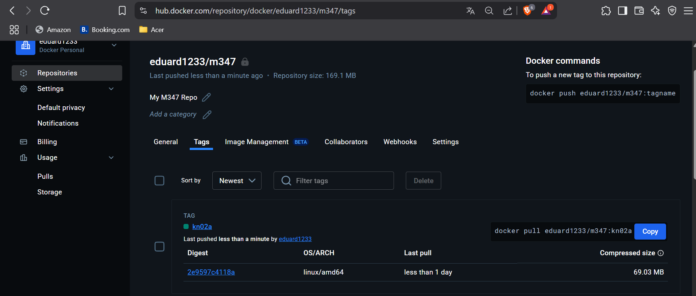

# Dockerfile

## A

```Dockerfile
FROM nginx  # Verwendet das offizielle nginx-Image als Basis (unterster Layer eingebunden).
COPY static-html-directory /var/www/html # Kopiert einen lokalen Ordner in Container (nicht korrekt für nginx!).
EXPOSE 80  # Gibt Port 80 für den Zugriff auf (Port für HTTP).
```

## 2. Anpassung des Dockerfiles

### Vorbereitung:

1. Lade die gewünschte `helloworld.html` herunter und speichere sie im Arbeitsverzeichnis.
2. Recherchiere den richtigen Pfad für statische HTML-Seiten im offiziellen `nginx` Image.
   ➞ Der Standard-Pfad ist: `/usr/share/nginx/html`

**Wichtig `helloworld.html`  ➞  `index.html` umbenennen**

### Angepasstes Dockerfile:

```Dockerfile
FROM nginx

WORKDIR /usr/share/nginx/html
COPY index.html .

EXPOSE 80
```

### Erklärung der Änderungen:

* FROM `nginx`: Verwendet das offizielle nginx-Image als Basis.
* `WORKDIR /usr/share/nginx/html`: Setzt das Arbeitsverzeichnis, so dass nachfolgende Befehle relativ zu diesem Verzeichnis ausgeführt werden.
* `COPY helloworld.html .`: Kopiert die Datei direkt in das Arbeitsverzeichnis.
* `EXPOSE 80`: Öffnet Port 80 für den Zugriff.

## 3. Build des eigenen Images

```bash
docker build -t eduard1233/m347:kn02a .
```

### Erklärung:

* `docker build`: Erstellt ein neues Image auf Basis der Docker-Datei (`.`).
* `t`: Gibt einen Namen (`eduard1233/m347:kn02a`).

## 4. Push des Images in das private Repository

```bash
docker push eduard1233/m347:kn02a
```

**Hinweis:**
Vorher sicherstellen, dass du bei Docker Hub eingeloggt bist.

## 5. Container starten und Webseite aufrufen

```bash
docker run -d -p 8082:80 --name my-kn02a eduard1233/m347:kn02a
```

**Webseite öffnen:**
Im Browser `http://localhost:8082/` aufrufen.





## B 

### Übersicht

Ziel dieser Aufgabe ist es, zwei eigene Docker-Images zu erstellen:

* **MariaDB Image (mit ENV Variablen im Dockerfile)**
* **PHP-Webserver Image (php:8.0-apache mit mysqli Erweiterung)**

Anschliessend werden die Container gestartet, damit sie sich gegenseitig erreichen können.
Die Images werden dann in das private Repository hochgeladen.

## 1. Erstellen des MariaDB Images

### Dockerfile für MariaDB

```Dockerfile
FROM mariadb

ENV MYSQL_ROOT_PASSWORD=root123
ENV MYSQL_DATABASE=testdb
ENV MYSQL_USER=admin
ENV MYSQL_PASSWORD=admin123

EXPOSE 3306
```

### Build des Images

```bash
docker build -t eduard1233/m347:kn02b-db .
```

### Push des Images

```bash
docker push eduard1233/m347:kn02b-db
```

### Container starten

```bash
docker network create kn02b-net

docker run -d --name kn02b-db eduard1233/m347:kn02b-db
```

## 2. Erstellen des PHP/Apache Images

### Verzeichnisstruktur

```
.
├── Dockerfile
├── info.php
└── db.php
```

### Dockerfile für Webserver

```Dockerfile
FROM php:8.0-apache

# Installiere mysqli
RUN docker-php-ext-install mysqli

# Kopiere die PHP-Dateien ins richtige Verzeichnis
COPY info.php /var/www/html/
COPY db.php /var/www/html/

EXPOSE 80
```

### Wichtige Hinweise:

* Laut Docker Hub Dokumentation für `php:8.0-apache` befinden sich die Webdateien unter `/var/www/html`.
* Mysqli muss zwingend mit `docker-php-ext-install` installiert werden.

### Anpassung der db.php Datei (Servername ändern!)

Da die Container mit dem Parameter „--link” verbunden werden, kann der Webcontainer den DB-Container über dessen Namen erreichen.

Änderung in `db.php`:

```php
$servername = "kn02b-db";
$username = "admin";
$password = "admin123";
$dbname = "testdb";
```

### Build des Images

```bash
docker build -t eduard1233/m347:kn02b-web .
```

### Push des Images

```bash
docker push eduard1233/m347:kn02b-web
```

### Container starten

```bash
docker run -d --name kn02b-web -p 8083:80 --link kn02b-db eduard1233/m347:kn02b-web
```

## 3. Test der Umgebung

1. Öffnen im Browser:

   * `http://localhost:8083/info.php`
   * `http://localhost:8083/db.php`

2. Die Seite `info.php` zeigt die PHP-Konfiguration.

3. Die Seite `db.php` sollte die Benutzer der MariaDB anzeigen.


