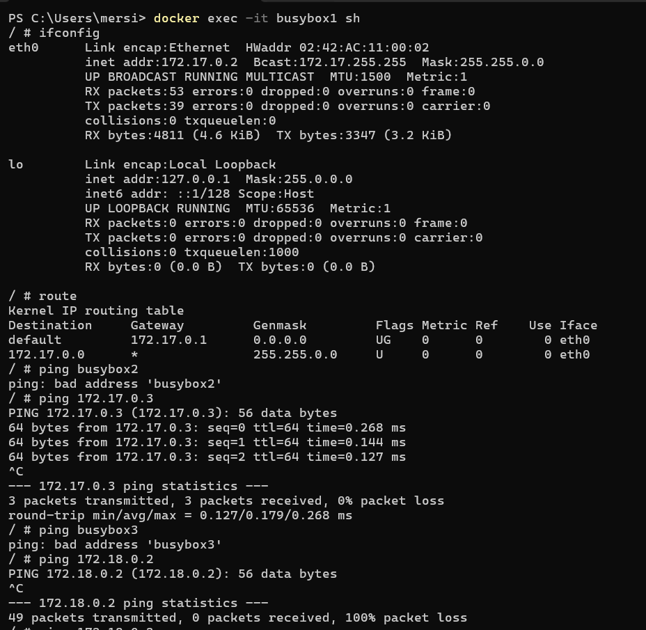
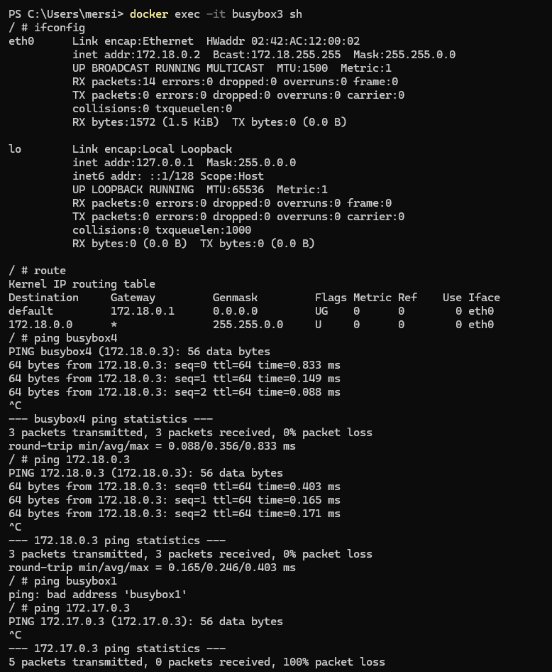

# Netzwerk, Sicherheit

### Erstellen eines benutzerdefinierten Netzwerks `tbz`

```bash
docker network create --subnet=172.18.0.0/16 tbz
```

* **Subnetz:** 172.18.0.0/16
* Docker verwaltet die IP-Adressen automatisch.

### Erstellen und Starten der Container

```bash
# Container im Default bridge Netzwerk (automatisch)
docker run -dit --name busybox1 busybox
docker run -dit --name busybox2 busybox

# Container im benutzerdefinierten Netzwerk tbz
docker run -dit --name busybox3 --network tbz busybox
docker run -dit --name busybox4 --network tbz busybox
```

## Netzwerk-Konfiguration und Tests

### IP-Adressen herausfinden

```bash
docker inspect busybox1
docker inspect busybox2
docker inspect busybox3
docker inspect busybox4


busybox1 # 172.17.0.2
busybox2 # 172.17.0.3
busybox3 # 172.18.0.2
busybox4 # 172.18.0.3
```

### Analyse auf `busybox1` (bridge Netzwerk)

```bash
docker exec -it busybox1 sh

# Netzwerkkonfiguration prüfen
ifconfig

# Default-Gateway prüfen
route

# Container im gleichen Netzwerk anpingen
ping busybox2
ping 172.17.0.3

# Container im anderen Netzwerk anpingen
ping busybox3
ping 172.18.0.2
```

### Analyse auf `busybox3` (tbz Netzwerk)

```bash
docker exec -it busybox3 sh

# Netzwerkkonfiguration prüfen
ifconfig

# Default-Gateway prüfen
route

# Container im gleichen Netzwerk anpingen
ping busybox4
ping 172.18.0.3

# Container im anderen Netzwerk anpingen
ping busybox1
ping 172.17.0.2
```

# In busybox1: docker exec -it busybox1 sh




# In busybox3: docker exec -it busybox3 sh
