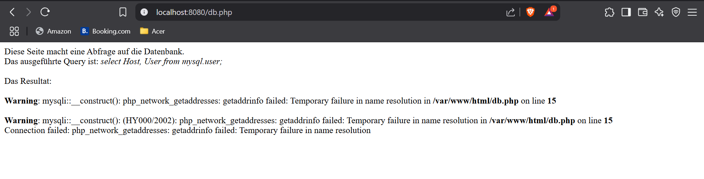

# Docker Compose

## Teil A: Verwendung von Original-Images

### Ziel

Erstellung einer Docker-Compose-Umgebung bestehend aus:

- **MariaDB-Container** auf Basis des offiziellen Images  
- **Webserver-Container**, basierend auf einem eigenen Dockerfile  
- Gemeinsames benutzerdefiniertes Netzwerk zur Kommunikation der Container  

### Docker-Compose Datei (`docker-compose.yml`)

Die Konfiguration befindet sich in [docker-compose-a.yml](./docker-compose-a.yml).

### Erklärung: Was macht `docker compose up`?

Der Befehl `docker compose up` vereint mehrere Docker-Befehle in einem Schritt:

| Teilbefehl              | Funktion                                                |
|-------------------------|----------------------------------------------------------|
| `docker compose build`  | Baut lokale Images, wenn ein `build:`-Abschnitt vorhanden ist |
| `docker compose create` | Erstellt die Container auf Basis der Compose-Datei       |
| `docker compose start`  | Startet die erstellten Container                          |
| `docker network create` | Legt benutzerdefinierte Netzwerke an                      |
| `docker volume create`  | Erstellt Volumes für persistente Daten                    |
| `docker compose run`    | Startet Services bei Bedarf (z. B. für einmalige Tasks)   |

**Zusammenfassung:**  
`docker compose up` sorgt für den vollständigen Aufbau und Start der Umgebung – inklusive Netzwerken, Volumes und Containern.

### Screenshots


## Teil B: Verwendung eigener Images

### Angepasste Docker-Compose Datei

Die angepasste Konfiguration befindet sich in [docker-compose-b.yml]().

### Webserver-Image aus KN02 auf Docker Hub bereitstellen

Zur Veröffentlichung des Webserver-Images auf Docker Hub können folgende Befehle verwendet werden:

```bash
docker build -t eduard1233/m347:kn04b-web .

docker push eduard1233/m347:kn04b-web

Ausserdem wurde ermöglicht, dass Variablen über eine `.env`-Datei bearbeitet werden können:

```php
$servername = getenv('DB_HOST');
$username   = getenv('DB_USER');
$password   = getenv('DB_PASS');
$dbname     = getenv('DB_NAME');
```

### Neue Screenshots




### Erklärung des Fehlers

Die Seite db.php versucht, auf die Datenbank zuzugreifen.

> **Fehlerursache:**
Das Image „webserver-kn02” ist bereits erstellt und beinhaltet feste IP-Adressen, falsche Hostnamen oder veraltete Konfigurationsdateien (z. B. „/var/www/html/db.php” mit einer festen IP-Adresse).

> **Lösung:**

* Stelle sicher, dass db.php dynamisch den Hostnamen „m347-kn04b-db” verwendet.

## B

[Cloud-init](./cloud-init.yaml)


