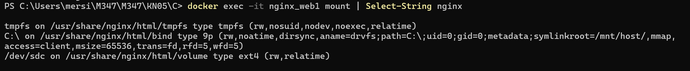

# Arbeit mit Speicher

## Bind Mount Demo mit Docker

***Bind Mounts*** ermöglichen den direkten Zugriff auf Dateien zwischen dem Host-System (z. B. Windows) und einem Docker-Container. Änderungen auf dem Host sind unmittelbar im Container verfügbar.

### 1. Bash-Skript erstellen

In `C:\docker-bind-test\mein-script.sh`:

```bash
#!/bin/bash
echo "Hallo von deinem Host-Skript! Stand: Version 1.0.0"
```
### 2. Container mit Bind Mount starten

```bash
docker run -it --rm -v C:/docker-bind-test:/app ubuntu bash
```

| Option   | Bedeutung                |
| -------- | ------------------------ |
| `-it`    | Interaktiv               |
| `--rm`   | Löscht Container danach  |
| `-v`     | Bind Mount               |
| `ubuntu` | Image                    |
| `bash`   | Shell starten            |

### 3. Skript im Container ausführen

```bash
cd /app
chmod +x mein-script.sh
./mein-script.sh
```
### 4. Skript am Host ändern

In `mein-script.sh`:

```bash
#!/bin/bash
echo "Hallo von deinem Host-Skript! Stand: Version 2.0.0"
```
### 5. Skript erneut im Container ausführen

```bash
./mein-script.sh
```
***Bind Mount aktiv:*** Änderungen auf dem Host erscheinen direkt im Container.

Bind Mounts – Vorteile

- Lokale Entwicklung und Tests im Container
- Konfigurationsdateien bereitstellen
- Logs/Daten auf Host speichern

## Gemeinsames Docker Volume zwischen Containern

Mehrere Container können ein gemeinsames Volume verwenden.

### 1. Volume erstellen

```bash
docker volume create gemeinsames-volumen
```
### 2. Zwei Container mit gleichem Volume starten

```bash
docker run -it --rm --name c1 -v gemeinsames-volumen:/data ubuntu bash
# In 2 Terminal:
docker run -it --rm --name c2 -v gemeinsames-volumen:/data ubuntu bash
```

| Option                         | Bedeutung           |
| ------------------------------ | ------------------- |
| `--rm`                         | Löscht Container    |
| `--name`                       | Name                |
| `-v gemeinsames-volumen:/data` | Volume einbinden    |

### 3. Schreiben & Lesen

**In Container 1:**
```bash
echo "Hallo von Container 1" >> /data/log.txt
cat /data/log.txt
```
**In Container 2:**
```bash
cat /data/log.txt
echo "Antwort von Container 2" >> /data/log.txt
```

**Zurück zu Container 1:**
```bash
cat /data/log.txt
```

Das gleiche Volume wird von beiden Containern genutzt.

### Vorteile von Named Volumes

- Persistente Daten
- Datenaustausch zwischen Containern
- Zentrale Logs/Konfiguration

## Docker Compose: Verschiedene Speicherarten

Mit **Docker Compose** können verschiedene Speicherarten genutzt werden:

- Bind Mount
- Named Volume
- tmpfs (RAM)

***Ziel:*** Zwei nginx-Container, von denen einer alle drei Speicherarten nutzt und der andere nur das Named Volume.

### Projektstruktur

```bash
KN05/C/
├── docker-compose.yml
├── html/
│   └── index.html
```


### 1. Bind-Mount-Ordner erstellen

```bash
echo "<h1>Bind Mount funktioniert!</h1>" > html/index.html
```

### 2. `docker-compose.yaml` Beispiel

```yaml
version: '3.9'
services:
  web1:
    image: nginx
    container_name: nginx_web1
    volumes:
      - type: volume
        source: shared-data
        target: /usr/share/nginx/html/volume
      - type: bind
        source: ./html
        target: /usr/share/nginx/html/bind
      - type: tmpfs
        target: /usr/share/nginx/html/tmpfs
  web2:
    image: nginx
    container_name: nginx_web2
    volumes:
      - shared-data:/usr/share/nginx/html/volume
volumes:
  shared-data:
```

### 3. Container starten

```bash
docker compose up -d
```

### 4. Speicher prüfen

**Im Container web-1:**
```bash
docker exec -it nginx_web1 mount | Select-String nginx
```



**Im Container web-2:**
```bash
docker exec -it nginx_web2 mount | Select-String nginx
```


| Typ              | Erklärung                        |
| ---------------- | ------------------------------- |
| Bind Mount       | Host-Verzeichnis einbinden       |
| Named Volume     | Docker verwaltet, persistent     |
| tmpfs            | RAM, nach Neustart leer          |