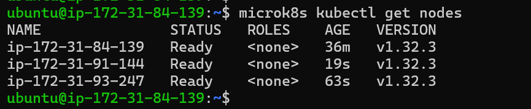
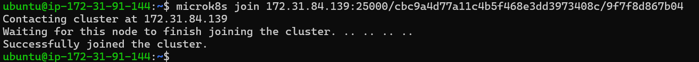
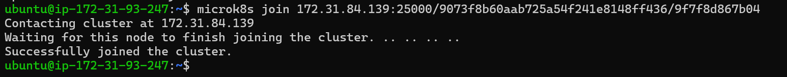
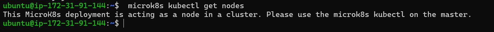
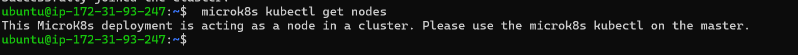
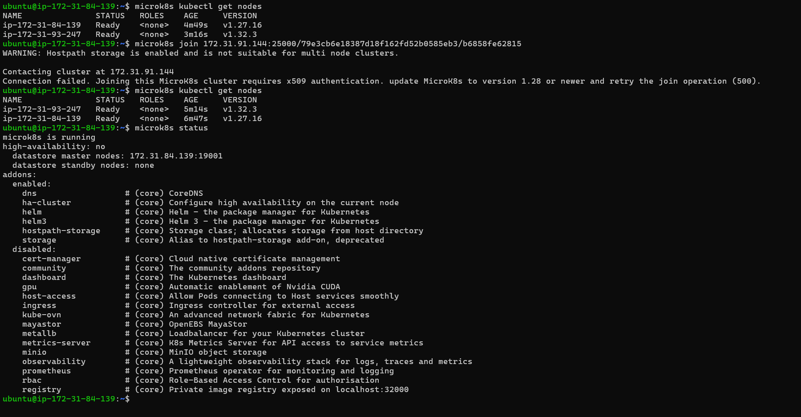
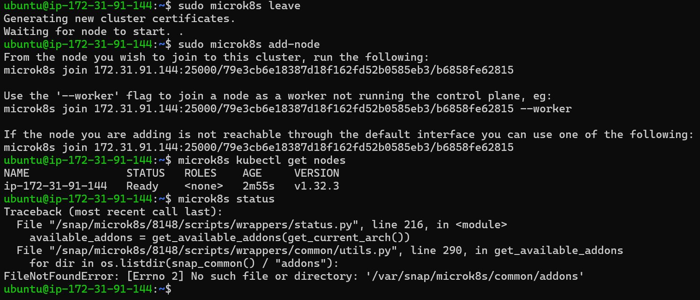
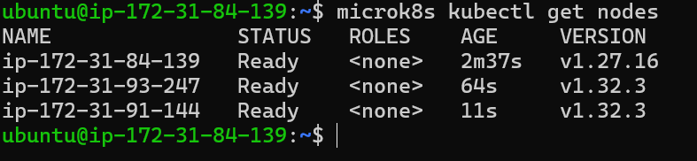

# Kubernetes I

## A

## B

### **Erklärung der einzelnen Zeilen:**

- `microk8s is running` → Zeigt an, dass MicroK8s aktuell aktiv ist und der Kubernetes-Dienst auf diesem Knoten ordnungsgemäß läuft.

- `high-availability` → Das System ist nicht im Hochverfügbarkeitsmodus (HA-Modus). Das bedeutet, es gibt keine Redundanz durch mehrere Knoten. In produktiven Umgebungen ist Hochverfügbarkeit entscheidend, um Ausfälle und Downtime zu vermeiden.

- `datastore master nodes` → Der Datenbankdienst von MicroK8s (typischerweise dqlite) läuft derzeit nur auf einem einzelnen Knoten mit der IP 172.31.77.18 am Port 19001. Dieser Knoten übernimmt die Rolle des primären Datenbank-Servers.

- `datastore standby nodes` → Es sind keine weiteren Standby-Knoten vorhanden, die im Fehlerfall übernehmen könnten. Das unterstreicht nochmals, dass keine Hochverfügbarkeitsarchitektur eingerichtet wurde.

- microk8s ist das Hauptkommando für MicroK8s – eine schlanke, lokal laufende Kubernetes-Distribution.

- microk8s kubectl ist ein Unterbefehl, der den Kubernetes-Client kubectl direkt innerhalb von MicroK8s verwendet.

`Der Unterschied:`

1. microk8s dient zur Verwaltung von MicroK8s selbst – z. B. zum Starten, Stoppen oder Aktivieren von Add-ons.
2. microk8s kubectl wird genutzt, um Kubernetes-Ressourcen wie Pods, Deployments oder Services zu verwalten – also die tatsächliche Arbeit im Cluster.