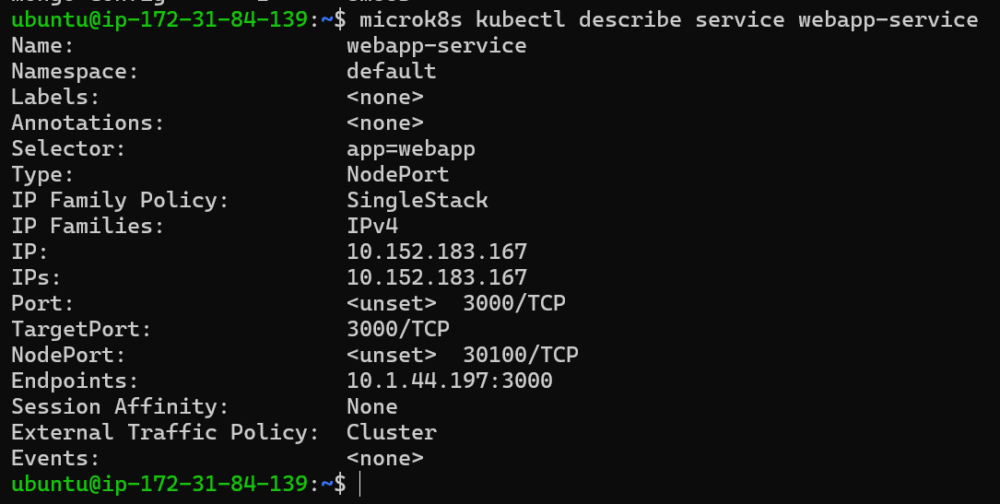
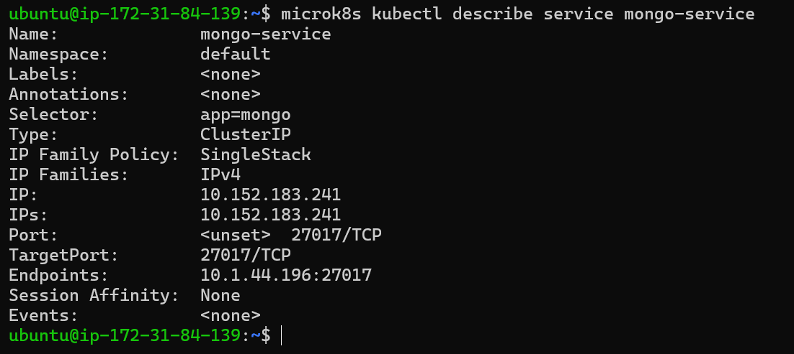
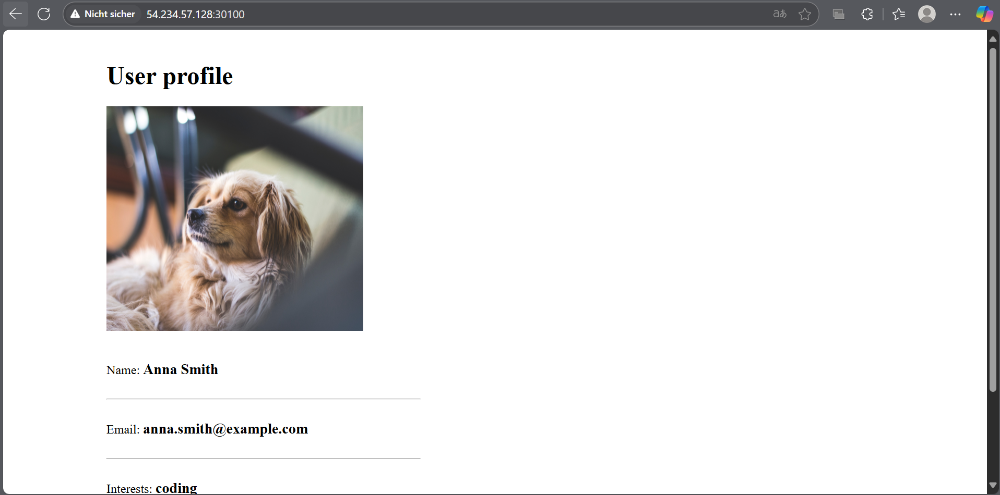
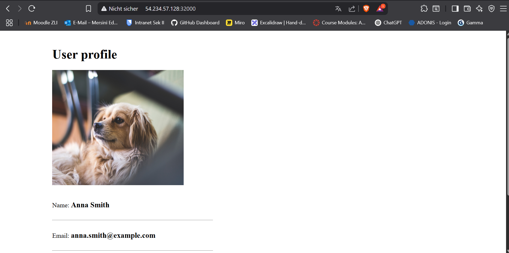

# Kubernetes II

## A 

`Pods vs. Replicas`

**Pod**: Die kleinste ausführbare Einheit in Kubernetes. Ein Pod enthält einen oder mehrere Container, die gemeinsam auf demselben Node laufen und sich Ressourcen teilen.

**Replica**: Gibt an, wie viele identische Instanzen (Kopien) eines Pods gleichzeitig laufen sollen. Kubernetes sorgt automatisch dafür, dass diese Anzahl jederzeit verfügbar bleibt.

`Deployment vs. Service`

**Deployment**: Verwaltet die Bereitstellung, Updates und Skalierung von Pods. Es stellt sicher, dass der gewünschte Zustand – z. B. die Anzahl an Replicas – eingehalten wird.

**Service**: Bietet eine stabile Netzwerkadresse für eine Gruppe von Pods, auch wenn sich deren IP-Adressen ändern. Services ermöglichen eine einfache und dauerhafte Erreichbarkeit der Anwendungen.

`Ingress`

Ein Ingress regelt den externen Zugriff auf Services innerhalb des Clusters. Es ermöglicht z. B. URL-basiertes Routing (/api, /shop etc.) oder Hostnamen-Routing – und spart so Load Balancer ein, da mehrere Routen über eine einzige öffentliche IP abgewickelt werden können.

`StatefulSet`

Ein StatefulSet wird verwendet, wenn Pods eine feste Identität, persistenten Speicher und eine definierte Start-/Stop-Reihenfolge benötigen. Es garantiert:

- Vorhersehbare Pod-Namen (z. B. broker-0, broker-1)
- Stabilen Speicher pro Pod
- Geordnete Updates und Wiederherstellung

## B

```sh
# 1. ConfigMap erstellen
kubectl apply -f mongo-config.yaml

# 2. Secret erstellen
kubectl apply -f mongo-secret.yaml

# 3. MongoDB Deployment & Service erstellen
kubectl apply -f mongo.yaml

# 4. WebApp Deployment & Service erstellen
kubectl apply -f webapp.yaml
```

## 1. Abweichung von Begrifflichkeiten/Tutorial

Im Projekt wurde die Datenbank **nicht** als eigenes Deployment mit separatem Service realisiert, sondern beispielsweise als einzelner Pod oder direkt im WebApp-Deployment eingebunden.
**Begründung:**
Obwohl das Tutorial empfiehlt, Datenbanken zur besseren Skalierbarkeit, Austauschbarkeit und Zuständigkeitstrennung als eigenständige Deployments mit Services zu betreiben, wurde im Projekt aus Gründen der Einfachheit darauf verzichtet. Für die Demo-Anwendung war eine separate Skalierung oder Trennung nicht erforderlich, wodurch eine integrierte Lösung ausreichte.

## 2. Erklärung der MongoUrl in der ConfigMap

In der `mongo-config.yaml` ist die `MongoUrl` wie folgt definiert (Beispiel):

```yaml
MONGO_URL: "mongodb://mongo-service:27017"
```

**Begründung:**  
Der angegebene Wert ist korrekt, da der Hostname `mongo-service` dem Kubernetes-Service entspricht, der auf die MongoDB-Instanz verweist. Innerhalb des Clusters können andere Pods diesen DNS-Namen verwenden, um die Datenbank zu erreichen. Der Port `27017` ist der Standardport für MongoDB und daher passend gewählt.

## 3. Nachweis: App wurde installiert

Führen Sie auf **mindestens zwei Nodes** folgenden Befehl aus und machen Sie Screenshots:

```sh
microk8s kubectl describe service webapp-service
```



## 4. Zweiter Service: Beschreibung & Unterschiede

Führen Sie dies auf einem Node aus:

```sh
microk8s kubectl describe service mongo-service
```

**Screenshot einfügen:**  


**Unterschiede:**  
- Die WebApp ist in der Regel als NodePort- oder LoadBalancer-Service konfiguriert, damit sie von aussen erreichbar ist.
- Die Datenbank (MongoDB) hingegen wird meist als ClusterIP-Service betrieben, sodass sie ausschliesslich innerhalb des Clusters erreichbar ist.
- Dies lässt sich an den angegebenen Servicetypen (Type: `NodePort` bzw. Type: `ClusterIP`) sowie an den zugewiesenen Ports erkennen.

## 5. Webseite aufrufen & Nachweis

- Prüfen Sie die Service-Konfiguration der WebApp (`kubectl describe service webapp-service`).
- Suchen Sie nach dem **NodePort** oder der externen IP-/Port-Kombination.
- Rufen Sie anschliessend die Webseite im Browser auf unter:
`http://<Node-IP>:<NodePort>`



**Erklärung:**  
- Die Seite ist über die Node-IP und den angegebenen Port erreichbar.
- Wird ein LoadBalancer verwendet, ist stattdessen die externe IP-Adresse zu nutzen.

## 6. Verbindung mit MongoDB Compass – Warum geht es nicht?

**Versuch:**  
Stellen Sie mit MongoDB Compass von Ihrem lokalen Computer eine Verbindung zur MongoDB im Kubernetes-Cluster her.

**Ergebnis:**  
Die Verbindung funktioniert nicht.

**Begründung:**  
- Der MongoDB-Service ist als `ClusterIP` konfiguriert und daher nur innerhalb des Kubernetes-Clusters erreichbar.
- Ein direkter Zugriff von aussen (z. B. von Ihrem lokalen Rechner) ist nicht möglich.

**Lösung:**  
- Den Service-Typ auf `NodePort` oder `LoadBalancer` ändern, um den Zugriff von aussen zu ermöglichen.
- Beispielkonfiguration für NodePort in der Datei `mongo-service.yaml`:

  ```yaml
  spec:
    type: NodePort
    ports:
      - port: 27017
        targetPort: 27017
        nodePort: 32017
  ```

- Anschliessend ist über Compass unter der Adresse `<Node-IP>:32017` ein Zugriff möglich.

**Hinweise:**  
- Füge an den markierten Stellen Screenshots ein.
- Führen Sie alle Befehle im Cluster aus, wie oben beschrieben.

## Service-Port ändern & Replicas erhöhen
Service-Port anpassen
In webapp-service.yaml den NodePort auf 32000 ändern:
```
spec:
  type: NodePort
  ports:
    - port: 80
      targetPort: 80
      nodePort: 32000
```

Replicas erhöhen
In webapp.yaml die Replicas auf 3 setzen:

```  
   spec:
     replicas: 3
``` 

Änderungen anwenden
```
   microk8s kubectl apply -f webapp.yaml
   microk8s kubectl apply -f webapp-service.yaml
```

Webseite aufrufen
Im Browser: **http://<Node-IP>:32000**

